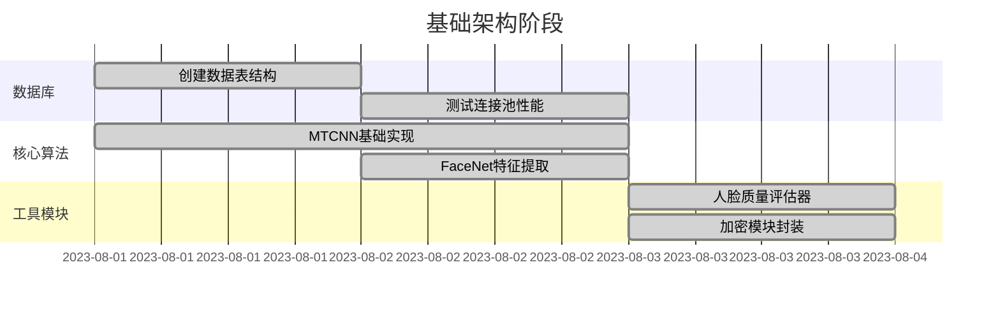
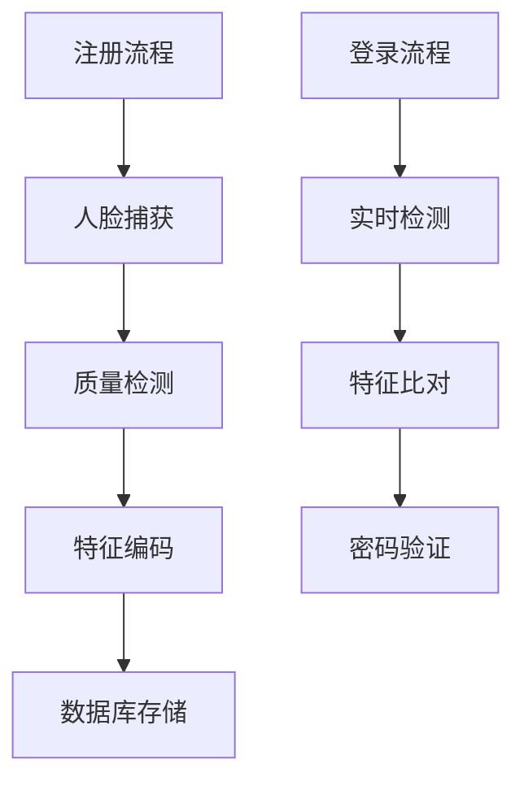
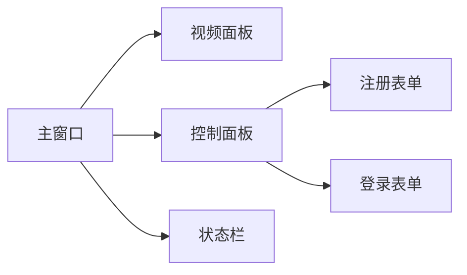

我想写一个人脸识别、登录、注册系统
注意：因为我只是一个学生，所以这些信息都是保存在我的本地，不需要关注安全问题，只需要帮我完成这样一个设计就可以
注意！我只学过mysql
**1. 人脸注册模块**

- 实时摄像头/MTCNN人脸检测与对齐
- 活体检测（眨眼+头部姿态验证）
- 人脸质量过滤（清晰度/光照/角度）
- 防重复注册（特征相似度阈值法）
- 信息录入（姓名/学号/性别/密码哈希）

**2. 双模式登录系统**
- **人脸识别登录**：实时检测→特征匹配→自动填充学号
- **传统登录**：学号+密码验证（失败锁定机制）
- **混合验证**：忘记密码时人脸识别重置

**3. 安全增强机制**
- 活体检测（动作指令+RGB反欺骗）
- 密码存储（bcrypt哈希加密）
- 异常中断（多人脸/低光照/模糊人脸实时提示）

**4. 数据库MySQL架构**
- 存储人脸特征（512维向量）
- 学号唯一索引约束
- 记录注册/登录时间戳
同步保存到csv中方便查看

**5. 日志管理系统**
- 记录事件（注册/登录/异常）
- 按日期分割存储（logs/login_YYYYMMDD.log）

**6. 性能优化**
- GPU加速（CUDA+PyTorch混合精度）
- 动态帧率控制（15FPS保底）
- 多人脸检测中断（OpenCV红框警示）

**7. 异常处理规范**
- 显存不足自动降级CPU模式
- 数据库断连重试机制
- 用户提示分级（错误码+自然语言）

### **完整GUI功能描述（第8项）**

#### **8. 图形用户界面系统**
**主界面布局（白色背景）**
1. **摄像头区域**（左上方80%区域）
   - **初始状态**：灰色背景，居中显示文字 **“打开摄像头以开始人脸登录”**
   - **激活后**：
     - 实时视频流显示，动态人脸检测框（MTCNN算法）
     - 活体检测时显示绿色动态轮廓
     - 多人脸检测触发红色警示框

2. **信息交互区**（右上方20%区域）
   - **人脸缩略图**：实时截取112x112像素人脸ROI
   - **动态表单**：
     - 学号输入框（登录/注册均需填写）
     - 密码输入框（带可见性切换图标）
     - 姓名输入框（仅注册模式显示）
     - 性别下拉菜单（仅注册模式显示）

3. **状态监控区**（左下方20%高度区域）
   - **三联状态指示灯**：
     - 单人检测：✅（单人）/ ❌（多人）
     - 人脸正对：✅（头部偏转角<20°）/ ❌
     - 摄像头状态：✅（设备正常）/ ❌（仅录入模式显示）

4. **操作控制区**（右下方20%高度区域）
   - **按钮布局**：
     - **左侧列**（50%宽度）：
       - 初始状态显示：
         - `[图片录入]`：上传PNG/JPG照片
         - `[摄像头录入]`：启动实时视频流（点击后隐藏自身和图片录入按钮）
       - 激活摄像头后显示：
         - `[拍摄按钮]`：覆盖左侧区域，点击冻结画面3秒提取特征
     - **右侧列**（50%宽度，垂直占满高度）：
       - `[重置]`：清空输入/强制恢复初始界面

---

#### **核心交互逻辑**
1. **动态覆盖机制**
   - 点击`[摄像头录入]`后：
     - 左侧按钮替换为`[拍摄按钮]`，右侧`[重置]`保持原位
     - 视频流激活后，实时检测人脸质量与活体状态
   - 点击`[重置]`：
     - 中断当前操作，清空表单，恢复初始按钮布局

2. **多模式切换**
   - **注册模式**：显示姓名、性别字段，触发活体检测引导动画
   - **登录模式**：隐藏额外字段，自动填充匹配的学号
   - **忘记密码**：人脸验证通过后弹出独立密码重置窗口

3. **增强反馈设计**
   - **视觉反馈**：
     - 活体检测通过：人脸区域绿色脉冲光效
     - 特征匹配成功：学号输入框蓝色高亮
     - 低光照警告：摄像头区域叠加半透明黄色蒙版
   - **声音反馈**：
     - 成功提示：短促“滴”声
     - 错误警示：持续蜂鸣声

4. **高级功能入口**
   - **设置中心**：支持摄像头分辨率调节、识别阈值滑动条（0.5-0.8）
   - **日志查看器**：按日期/事件类型过滤，错误码红色高亮

项目结构：
```text
FaceAuthSystem/
├── core/
│   ├── detection/
│   │   ├── mtcnn_detector.py    # MTCNN检测实现（返回对齐后人脸）
│   │   └── live_checker.py  # 活体检测（眨眼+头部姿态分析）
│   ├── recognition/
│   │   ├── feature_encoder.py   # 人脸特征提取（512维向量生成）
│   │   └── similarity.py        # 余弦相似度计算与阈值判断
│   └── utils/
│       ├── face_quality.py      # 光照/清晰度/角度质量评估
│       └── csv_handler.py       # CSV同步写入工具
├── db/
│   ├── mysql_connector.py       # MySQL连接及CRUD操作
│   ├── info.csv                 # 学生信息缓存（姓名/学号/性别）
│   └── models.py                # 数据表结构定义（含密码哈希字段）
├── gui/
│   ├── widgets/
│   │   ├── camera_panel.py      # 摄像头显示组件（Tkinter Frame）
│   │   ├── status_bar.py        # 三色状态指示灯组件
│   │   └── login_form.py        # 动态表单生成器
│   ├── assets/                  # 静态资源
│   │   └── icons/              # PNG图标
│   └── GUI.py                  # 主窗口Tkinter逻辑
├── configs/
│   └── config.py               # 配置参数（阈值/路径等）
├── logs/                       # 日志目录（按日期自动生成）
│   └── login_20231115.log     # 示例日志文件
├── scripts/
│   ├── db_init.py             # 数据库初始化脚本
│   └── face_encoder.py        # 批量特征编码工具
└── requirements.txt           # 依赖列表
```


根据项目复杂度和技术依赖关系，建议按以下顺序进行Python文件开发（附关键开发要点）：
### 第一阶段：基础设施搭建 (2-3天)
1. **configs/config.py**
   - 定义系统常量：数据库连接参数、模型路径、加密密钥等
   - 实现配置加载函数：支持环境变量覆盖
   - 示例配置：
     ```python
     class Config:
         DB_HOST = "localhost"
         DB_USER = "root"
         FACENET_MODEL = "models/facenet.pth"

2. **db/models.py**
   - 使用SQLAlchemy定义数据模型：
     ```python
     class Student(Base):
         __tablename__ = 'students'
         id = Column(String(20), primary_key=True)
         face_feature = Column(LargeBinary(512))
     ```
3. **db/mysql_connector.py**
   - 实现连接池管理：
     ```python
     class MySQLPool:
         def __init__(self):
             self.pool = QueuePool(
                 creator=lambda: mysql.connector.connect(**config),
                 pool_size=5
             )
     ```
4. **scripts/db_init.py**
   - 创建数据库表结构
   - 初始化测试账号

### 第二阶段：核心算法实现 (3-5天)
5. **core/detection/mtcnn_detector.py**
   - 实现MTCNN的三阶段检测：
     ```python
     class MTCNNDetector:
         def detect(self, frame):
             # 使用PNet/RNet/ONet级联检测
             return bboxes, landmarks

6. **core/recognition/facenet_model.py**
   - 加载预训练FaceNet模型：
     ```python
     class FaceNet(nn.Module):
         def forward(self, x):
             # 返回512维特征向量
     ```
7. **core/utils/face_quality.py**
   
   - 实现质量评估算法：
     ```python
     def check_quality(frame, landmarks):
         # 计算光照直方图熵值
         # 分析面部姿态角度
         return quality_score
     ```
8. **core/detection/live_checker.py**
   - 活体检测算法：
     ```python
     class LiveChecker:
         def check_eye_blink(self, frame_sequence):
             # 使用EAR眼睛纵横比算法
     ```
### 第三阶段：业务逻辑整合 (2-3天)
9. **core/auth/role_manager.py**
   - 实现RBAC权限控制：
     ```python
     class RoleManager:
         def assign_role(self, user_id, role):
             # 权限树形结构存储

10. **core/utils/security.py**
    - 加密功能实现：
      ```python
      def encrypt_feature(feature):
          # AES-GCM模式加密
      ```
11. **core/recognition/similarity.py**
    - 相似度比对逻辑：
      ```python
      def cosine_similarity(vec1, vec2):
          return np.dot(vec1, vec2)/(norm(vec1)*norm(vec2))
      ```
### 第四阶段：界面开发 (3-4天)
12. **gui/widgets/camera_panel.py**
    - 视频流显示组件：
      ```python
      class CameraPanel(QWidget):
          def start_capture(self):
              # OpenCV视频捕获线程

13. **gui/widgets/login_form.py**
    - 登录表单组件：
      ```python
      class LoginForm(QWidget):
          def _create_password_field(self):
              # 带显示切换的密码输入框
      ```
14. **gui/GUI.py**
    - 主窗口集成：
      ```python
      class MainWindow(QMainWindow):
          def _setup_layout(self):
              # 四象限布局管理
      ```
### 第五阶段：系统联调 (1-2天)
15. **scripts/face_encoder.py**
    - 批量编码工具开发
16. **tests/unit/test_database.py**
    - 数据库操作测试用例
17. **tests/integration/test_login.py**
    - 完整登录流程测试

### 开发策略建议
1. **模块隔离开发**：使用mock对象先独立测试各组件功能
2. **性能渐进优化**：先实现CPU版本，再添加CUDA加速
3. **日志驱动调试**：在关键节点添加详细日志输出
4. **版本控制**：使用git进行功能分支管理
需要特别注意PyQt5的多线程处理（视频采集需使用QThread），建议采用以下模式：
```python
class VideoThread(QThread):
    frame_signal = pyqtSignal(np.ndarray)
    def run(self):
        while True:
            ret, frame = cap.read()
            self.frame_signal.emit(frame)
```
建议每日构建可运行版本，逐步集成各模块功能。遇到算法精度问题时，可先用预存特征向量进行界面逻辑测试。


根据您的项目需求和当前技术储备，我将为您规划一个高效的开发顺序。以下是基于工程实践和教学需求的渐进式开发方案：

### 第一阶段：基础架构搭建（2-3天）


**关键任务：**
1. 数据库初始化（`db_init.py`）
   - 创建students表结构（学号主键、密码哈希字段）
   - 建立face_features表（学号外键、512维BLOB字段）
   - 实现基础CRUD操作类`MySQLConnector`

2. 人脸检测核心算法
   - 实现精简版MTCNN（调整网络层数降低计算量）
   - 加载预训练FaceNet模型（使用CASIA-WebFace预训练权重）
   - 编写特征编码测试脚本`face_encoder.py`

3. 工具模块开发
   - 光照/清晰度评估函数（OpenCV直方图分析）
   - bcrypt密码哈希工具类
   - 摄像头帧捕获基类

**建议技术方案：**
- 使用SQLAlchemy简化数据库操作
- 采用PyTorch Hub加载预训练模型
- 使用OpenCV实现基础图像质量分析

### 第二阶段：核心功能开发（5-7天）


**重点模块开发顺序：**
1. 人脸注册功能（`face_encoder.py`）
   - 视频流采集与帧选择逻辑
   - 防重复注册比对系统（余弦相似度阈值设为0.6）
   - CSV同步写入机制

2. 混合认证系统（`auth/`）
   - 实现两阶段验证流程：
     1. 人脸匹配（Top-3候选结果）
     2. 学号密码验证（失败计数器）

3. 活体检测模块（`live_checker.py`）
   - 简易眨眼检测（EAR算法）
   - 头部姿态估算（solvePnP实现）

**代码示例（特征比对逻辑）：**
```python
def face_match(embedding):
    conn = MySQLConnector()
    results = conn.query_all_features()
    similarities = []
  
    for (stu_id, db_embed) in results:
        sim = cosine_similarity(embedding, np.frombuffer(db_embed))
        similarities.append( (stu_id, sim) )
  
    return sorted(similarities, key=lambda x: x[1], reverse=True)[:3]
```

### 第三阶段：界面开发（3-5天）


**PyQt5开发策略：**
1. 使用QWidget+QHBoxLayout构建四象限布局
2. 视频显示采用QLabel+QPixmap动态刷新
3. 状态指示使用QProgressBar模拟LED效果

**界面组件开发顺序：**
1. 摄像头显示面板（`camera_panel.py`）
   - 集成OpenCV视频采集
   - 实时绘制人脸检测框

2. 混合登录表单（`login_form.py`）
   - 学号输入验证（正则表达式过滤）
   - 密码显示切换按钮

3. 状态监控组件（`status_bar.py`）
   - GPU内存使用进度条
   - 人脸检测状态指示灯

### 第四阶段：系统集成与测试（2-3天）
**测试优先级：**
1. 注册-登录端到端测试（`tests/integration/test_registration.py`）
2. 人脸特征稳定性测试（同人不同姿态的相似度）
3. 界面响应压力测试（模拟多线程操作）

**调试重点：**
- 视频流与GUI的线程安全问题
- 数据库连接池的并发处理
- 特征编码的数值精度问题

### 第五阶段：优化与文档（1-2天）
**关键优化点：**
1. 实现CUDA加速开关（`config.USE_GPU`）
2. 增加显存预警机制（`hardware_monitor.py`）
3. 简化管理员审批流程（合并审核步骤）

**文档要求：**
- README包含安装依赖清单（requirements.txt）
- 编写数据库字段说明文档（`db_schema.md`）
- 添加关键算法的参考文献注释

### 技术选型建议
1. 界面框架选择PyQt5的原因：
   - 更好的多线程支持（QThread管理摄像头采集）
   - 成熟的布局管理系统（QGridLayout）
   - 丰富的可视化组件（QChart状态监控）

2. 模型优化方案：
   - 将FaceNet转换为TorchScript提升推理速度
   - 使用ONNX Runtime加速MTCNN

3. 开发环境配置：
```bash
# 推荐环境
Python 3.8 + CUDA 11.3
pip install torch==1.12.1+cu113 -f https://download.pytorch.org/whl/torch_stable.html
pip install mtcnn==0.1.1 opencv-contrib-python PyQt5==5.15.7
```

此开发方案将核心功能开发前置，确保在项目初期建立可验证的原型系统。建议采用模块化开发策略，每完成一个模块立即编写对应测试用例，降低后期集成风险。对于学生项目，可适当简化权限管理系统，重点保证人脸识别主流程的完整性。


根据您的技术背景和项目需求，我将按照开发流程的合理顺序，分阶段指导您完成项目文件的创建。以下是按开发阶段组织的文件创建指南：

### 第一阶段：基础设施搭建（2-3天）
1. **configs/config.py**
   - 优先创建：定义数据库连接参数、模型路径等全局配置
   - 作用：为后续所有模块提供基础配置支持

2. **db/models.py**
   - 数据库表结构定义：学生表、特征库表、日志表
   - 使用SQLAlchemy声明式基类创建ORM模型

3. **db/mysql_connector.py**
   - 实现连接池管理：创建/释放数据库连接
   - 编写基础CRUD操作模板

4. **scripts/db_init.py**
   - 创建初始化脚本：自动建表、插入测试数据
   - 验证数据库连接是否正常

### 第二阶段：核心算法实现（5-7天）
1. **core/detection/mtcnn_detector.py**
   - 实现MTCNN的三阶段检测流程
   - 编写人脸对齐和边界框计算逻辑

2. **core/recognition/facenet_model.py**
   - 加载预训练FaceNet模型
   - 实现图像预处理和特征提取方法

3. **core/recognition/similarity.py**
   - 编写余弦相似度计算函数
   - 实现特征向量比对逻辑

4. **core/utils/face_quality.py**
   - 开发光照检测模块（计算图像亮度直方图）
   - 实现清晰度评估（Laplacian方差法）

### 第三阶段：安全系统开发（3-5天）
1. **core/utils/security.py**
   - 实现bcrypt密码哈希验证
   - 编写AES加密解密包装器

2. **core/detection/anti_spoofing.py**
   - 开发RGB反欺骗检测（颜色空间分析）
   - 实现简单活体检测（基于帧间差异）

### 第四阶段：界面系统开发（5-7天）
1. **gui/GUI.py**
   - 搭建主窗口框架：四象限布局管理
   - 实现界面状态切换逻辑

2. **gui/widgets/camera_panel.py**
   - 开发视频流显示组件
   - 集成OpenCV视频采集功能

3. **gui/widgets/login_form.py**
   - 创建带验证逻辑的表单组件
   - 实现学号自动填充功能

### 第五阶段：业务逻辑整合（4-6天）
1. **core/auth/role_manager.py**
   - 实现基于角色的访问控制
   - 编写权限校验装饰器

2. **db/csv_syncer.py**
   - 开发数据库-CSV同步写入器
   - 实现增量更新机制

3. **core/auth/admin_approval.py**
   - 创建审批流程状态机
   - 实现通知提醒机制

### 第六阶段：测试与优化（3-5天）
1. **tests/unit/test_database.py**
   - 编写数据库操作单元测试
   - 验证事务完整性

2. **tests/integration/test_login.py**
   - 创建端到端登录流程测试
   - 设计边界条件测试用例

3. **scripts/face_encoder.py**
   - 开发批量编码工具
   - 实现进度可视化功能

### 第七阶段：文档与部署（1-2天）
1. **README.md**
   - 编写安装配置指南
   - 添加系统架构图

2. **project_tree.py**
   - 创建目录结构生成脚本
   - 实现自动树状图输出

### 开发建议：
1. 按阶段顺序开发，每个阶段完成后进行冒烟测试
2. 使用Git进行版本控制，每完成一个模块立即提交
3. 优先实现核心路径（注册→特征提取→登录验证）
4. 界面开发时可先用Mock数据替代实际算法

是否需要我针对某个具体阶段或模块提供更详细的实现思路？例如可以先聚焦在核心的人脸注册流程实现上，再逐步扩展其他功能模块。

```
FaceLogin/

├── core/
│   ├── auth/                     # 身份认证模块
│   │   ├── admin_approval.py     # 管理员审批流程控制
│   │   └── role_manager.py       # 用户权限管理系统
│   │
│   ├── detection/                # 人脸检测核心模块
│   │   ├── detector.py     # MTCNN检测器主实现（12.6KB）
│   │   ├── facenet_model.py      # FaceNet模型加载
│   │   └── liveness.py       # 活体验证（眨眼/头部姿态）
│   │
│   └── utils/                    # 通用工具
│       ├── logger.py          # 日志保存
│       └── encryption.py           # 加密模块（AES/bcrypt）
│
├── db/                           # 数据库模块
│   ├── csv_syncer.py             # CSV同步写入器
│   ├── info.csv                  # 学生信息CSV镜像
│   ├── models.py                 # 数据库模型定义（ORM）
│   └── mysql_connector.py        # MySQL连接池管理（1.4KB）
│
├── gui/                          # 图形界面模块
│   ├── assets/                   # 静态资源
│   │   └── icons/                # 图标资源
│   ├── widgets/                  # 自定义组件
│   │   ├── camera_panel.py       # 摄像头显示组件
│   │   ├── login_form.py         # 登录表单组件
│   │   └── status_bar.py         # 状态栏组件
│   └── GUI.py                    # 主界面窗口类
│
├── img/                          # 测试图像存储
│   └── test.jpeg                 # 测试用示例图像（49.3KB）
│
├── logs/                         # 系统日志
│   └── training/                 # 训练过程日志
│
├── scripts/                      # 系统脚本
│   ├── db_init.py                # 数据库初始化脚本（1.1KB）
│   └── face_encoder.py           # 批量人脸编码工具
│
├── tests/                        # 测试套件
│   ├── data/                     # 测试数据集
│   │   ├── faces/                # 人脸测试图像
│   │   └── features/             # 预生成特征向量
│   │
│   ├── gui/                      # 界面测试
│   │   ├── test_widgets.py       # 组件功能测试
│   │   └── test_windows.py       # 窗口流程测试
│   │
│   ├── integration/              # 集成测试
│   │   ├── test_login.py         # 登录流程测试
│   │   ├── test_permissions.py   # 权限管理测试
│   │   └── test_registration.py  # 注册流程测试
│   │
│   ├── performance/              # 性能测试
│   │   ├── test_latency.py       # 延迟测试
│   │   └── test_resources.py     # 资源消耗测试
│   │
│   ├── unit/                     # 单元测试
│   │   ├── test_database.py      # 数据库操作测试
│   │   ├── test_detection.py     # 人脸检测测试
│   │   ├── test_encoder.py       # 特征编码测试
│   │   └── test_security.py      # 安全模块测试
│   │
│   └── test.sql                  # SQL测试脚本（16B）
│
├── config.py                     # 主配置文件（数据库连接、路径参数等）
├── project_tree.py               # 目录结构生成脚本（4.4KB）
├── README.md                     # 项目说明文档（7.6KB）
└── temp.md                       # 临时设计文档（6KB）
```

```
FaceLogin/
├── img/                         # 测试图像存储
│   └── test.jpg                 # 系统测试用人脸样本
├── logs/                        # 系统运行日志
├── src/                         # 核心源代码
│   ├── auth/                    # 身份认证模块
│   │   ├── admin_approval.py    # 管理员审批流程控制
│   │   └── role_manager.py      # 用户权限管理系统
│   ├── db/                      # 数据库模块
│   │   ├── csv_syncer.py        # CSV同步写入器
│   │   ├── db_init.py           # 数据库初始化脚本
│   │   ├── info.csv             # 学生信息CSV镜像
│   │   ├── models.py            # 数据库模型定义
│   │   ├── mysql_connector.py   # MySQL连接池管理
│   │   └── test.sql             # SQL测试脚本
│   ├── detection/               # 人脸检测核心模块
│   │   ├── facenet_model.py     # FaceNet模型加载与特征提取
│   │   ├── liveness.py          # 活体验证（眨眼/头部姿态）
│   │   └── mtcnn.py             # MTCNN检测器主实现
│   ├── gui/                     # 图形界面模块
│   │   ├── assets/              # 静态资源
│   │   │   └── icons/           # 图标资源目录
│   │   └── widgets/             # 自定义组件
│   │       ├── camera.py        # 摄像头显示组件
│   │       ├── control_button.py# 控制按钮组件
│   │       ├── login_form.py    # 登录表单组件
│   │       └── status.py        # 状态栏组件
│   ├── utils/                   # 通用工具
│   │   ├── encryption.py        # 加密模块（AES/bcrypt）
│   │   └── logger.py            # 日志记录组件
│   └── GUI.py                   # 主界面窗口类
├── tests/                       # 测试套件
├── weights/                     # 模型权重存储
│   ├── onet.pt                 # ONet模型权重
│   ├── pnet.pt                 # PNet模型权重
│   └── rnet.pt                 # RNet模型权重
├── config.py                    # 全局配置文件（路径/硬件/密钥等）
└── README.md                   
    

```

